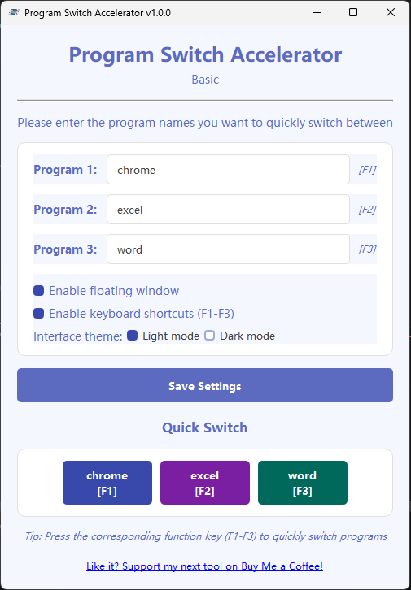

# Program Switch Accelerator (Basic Edition)

A lightweight Windows tool to quickly switch between frequently used programs with hotkeys (F1-F3) and a floating window. Offline, no installation needed, free and open-source!

## Important Notice

**Regarding Antivirus False Positives:**
Since this application uses keyboard monitoring (pynput) and window operation (pywin32, pygetwindow) functionalities, some antivirus software may incorrectly flag it as a potential virus or malware. This is a common phenomenon that occurs with many open-source tools using similar functions.

This application is completely open source, and you can inspect all the source code to confirm its safety. If your antivirus software issues a warning, you can:
1. Review the source code to verify its functionality
2. Add the application to your antivirus whitelist
3. Compile and run the code yourself from the source

All code is transparent and open source, used solely to implement program quick-switching functionality, and contains no malicious operations.

## Features

- **Quick Program Switching**: Switch between your favorite applications with a single click or keyboard shortcut
- **Floating Window**: Access your programs through a convenient floating window that stays on top
- **Keyboard Shortcuts**: Use function keys (F1-F3) to instantly switch to your most used programs
- **Dark/Light Theme**: Choose between light and dark interface themes based on your preference
- **Auto-Detection**: Smart program detection that can find and launch applications even with partial names

## Requirements

- Windows operating system
- Python 3.6 or higher
- PyQt5
- pynput
- pygetwindow
- pywin32

## Installation

1. Clone this repository or download the source code: git clone https://github.com/kentchiu666/Program-Switch-Accelerator.git

2. Install the required dependencies: pip install -r requirements.txt

3. Run the application: python main.py

## Usage

1. **Set Up Your Programs**:
- Enter the names of programs you want to switch between
- The first 3 programs will be assigned to function keys F1, F2, and F3

2. **Enable Features**:
- Check "Enable floating window" to show a floating toolbar
- Check "Enable keyboard shortcuts" to use F1-F3 keys for switching

3. **Choose Your Theme**:
- Select "Light mode" or "Dark mode" based on your preference

4. **Save Settings**:
- Click "Save Settings" to apply your changes

5. **Program Switching**:
- Click on program buttons in the main window or floating window
- Or use the assigned function keys (F1-F3) when enabled

## Structure

The application is organized into the following components:

- **main_window.py**: Main application window and controller
- **floating_window.py**: Floating toolbar implementation
- **hotkey_manager.py**: Manages keyboard shortcut detection
- **window_manager.py**: Handles window detection, activation, and program launching
- **settings_manager.py**: Manages application settings and configuration
- **theme_manager.py**: Provides UI themes and styling
- **ui_components.py**: Custom UI components for consistent look and feel
- **program_mappings.py**: Program name mappings for different platforms

## Configuration

Settings are stored in `~/.program_switch_accelerator/config.json` and include:
- Configured programs
- Floating window preference
- Theme preference
- Hotkey enablement

## Troubleshooting

If a program doesn't launch correctly:
1. Try using the exact executable name (e.g., "chrome.exe" instead of "chrome")
2. Ensure the program is installed and accessible from your system PATH
3. For non-standard applications, use the full path to the executable

## License

MIT License

Copyright (c) 2025 Kent Chiu

Permission is hereby granted, free of charge, to any person obtaining a copy
of this software and associated documentation files (the "Software"), to deal
in the Software without restriction, including without limitation the rights
to use, copy, modify, merge, publish, distribute, sublicense, and/or sell
copies of the Software, and to permit persons to whom the Software is
furnished to do so, subject to the following conditions:

The above copyright notice and this permission notice shall be included in all
copies or substantial portions of the Software.

THE SOFTWARE IS PROVIDED "AS IS", WITHOUT WARRANTY OF ANY KIND, EXPRESS OR
IMPLIED, INCLUDING BUT NOT LIMITED TO THE WARRANTIES OF MERCHANTABILITY,
FITNESS FOR A PARTICULAR PURPOSE AND NONINFRINGEMENT. IN NO EVENT SHALL THE
AUTHORS OR COPYRIGHT HOLDERS BE LIABLE FOR ANY CLAIM, DAMAGES OR OTHER
LIABILITY, WHETHER IN AN ACTION OF CONTRACT, TORT OR OTHERWISE, ARISING FROM,
OUT OF OR IN CONNECTION WITH THE SOFTWARE OR THE USE OR OTHER DEALINGS IN THE
SOFTWARE.

## Acknowledgements

- Built with PyQt5
- Uses pynput for hotkey detection
- Uses pywin32 for Windows API integration
- Uses pygetwindow for window management

## Support

Built by Kent Chiu. Love it? [Buy me a coffee](https://buymeacoffee.com/kentchiu7832) to fuel more tools!